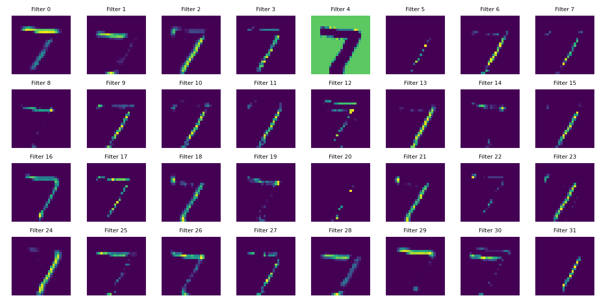

# Day 9：卷积层实战 + 特征图可视化

**日期：** 2026-06-02

---

## 一、今日目标

把 Day 8 的概念变成可以跑、可以"看见"的代码：

- 搭建 Conv2D → MaxPooling2D → Flatten → Dense 管道
- 训练一个 CNN
- **可视化卷积层的输出**——看看卷积核到底"看到了"什么

---

## 二、模型结构

```
Conv2D(32, 3×3) → MaxPooling2D(2×2) → Flatten → Dense(10)
```

用 `model.summary()` 看参数：

| 层 | 输出 Shape | 参数量 |
|---|---|---|
| Conv2D | (None, 26, 26, 32) | 320 |
| MaxPooling2D | (None, 13, 13, 32) | 0 |
| Flatten | (None, 5408) | 0 |
| Dense | (None, 10) | 54,090 |

---

## 三、Conv2D 的输入要求：理解 4D Shape

Conv2D 要求输入必须是 4 维：**(batch, height, width, channels)**

MNIST 原始数据是 3 维 `(60000, 28, 28)`——没有通道维度。

为什么 TF 能直接训练但不能单独预测一张图？因为训练时 `fit()` 内部自动加了通道维度，但手动 `predict` 一张图时必须自己补上：

```python
# 训练数据 shape: (60000, 28, 28)  ← fit() 内部自动补通道
# 单张预测必须 reshape:
img = test_images[0].reshape(1, 28, 28, 1)
#                            ↑ batch=1    ↑ channel=1(灰度)
```

**input_shape 规则：** `input_shape=(28, 28, 1)` 只写 HW+C，batch 由 Keras 自动处理。

---

## 四、核心技巧：截取中间层输出

如何"看见"卷积层内部？用 Keras 的 **Model 函数式 API** 构建一个"辅助模型"：

```python
from tensorflow.keras.models import Model

x = model.inputs[0]          # 原模型的输入
y = model.layers[0].output   # 第一个 Conv2D 层的输出
model1 = Model(inputs=x, outputs=y)   # 新模型：输入→第一层输出
```

**关键理解：** `Model` 和 `Sequential` 不一样。
- `Sequential` 是"把层串起来"，input/output 固定
- `Model` 是"指定输入张量和输出张量"，可以任意连接

这里 `model1` 的输入和原模型完全一样，但输出**截断在第一个 Conv2D 层**——拿到的是 32 张特征图。

---

## 五、特征图可视化

取测试集第一张图，喂给截断模型 `model1`，得到 32 张 26×26 的特征图，用 matplotlib 画成 4 行 8 列的网格：



### 从特征图中能看到什么？

- **不同滤波器学到不同的东西**——有的对横线敏感，有的对竖线敏感，有的捕捉斜边，有的只是噪声
- **越亮的区域 = 该模式在该位置的响应越强**
- **有些滤波器几乎全黑**——可能还没来得及收敛（只训了 5 epochs），或者这个模式在数字 7（第一张测试图）上不存在
- **这就是 CNN 的"眼睛"**——第一层学到的都是低级边缘/纹理特征，深的层才会组合出更抽象的形状

---

## 六、训练配置

```python
model.compile(
    optimizer=Adam(learning_rate=0.001),
    loss=SparseCategoricalCrossentropy(from_logits=True)   # 注意：Dense(10) 没加 softmax
)
model.fit(..., epochs=5, callbacks=[EarlyStopping(monitor='val_loss', patience=3)])
```

- `from_logits=True` + 最后一层没 softmax → 输出是 logits，loss 内部自动做 softmax
- `EarlyStopping` 从 Day 6 就用了，防止过拟合已经成了习惯

---

## 七、遇到的关键问题

### 问题：环境缺 matplotlib
- **现象：** Pylance 报 "无法解析 matplotlib.pyplot"，跑代码直接 `ModuleNotFoundError`
- **原因：** 新建的 `.venv` 只装了 tensorflow 和 numpy，没装可视化库
- **解决：** `pip install matplotlib`

### 问题：Pylance 对 TensorFlow 子模块误报
- **现象：** `from tensorflow.keras.models import Model` 报 "无法从源解析导入"
- **原因：** TF 用懒加载动态注入子模块，Pylance 静态分析追不到
- **解决：** `.vscode/settings.json` 中设 `reportMissingModuleSource: "none"`——这不影响运行

---

## 八、Day 8 → Day 9 思维变化

| | Day 8 | Day 9 |
|---|---|---|
| 对卷积的理解 | 概念层面：滑动窗口、参数共享 | 实操层面：看到 32 个滤波器各学到了什么 |
| 对 Shape 的理解 | 知道 input_shape 怎么写 | 理解了为什么预测时必须 reshape 补 batch+channel |
| 对 Model 的理解 | 只用 Sequential | 第一次用函数式 Model 截取中间层 |

---

## 九、代码产出

`cnn1.py`：Conv2D 实战 + 特征图可视化

两段式结构：
1. **前半段：** 建模型 → 编译 → 训练（标准的 CNN 流程）
2. **后半段：** 截取 Conv2D 输出 → 可视化 32 张特征图 → matplotlib 4×8 网格

---

## 十、比赛相关——AI 支持的自主学习

**今日体现的 AI 引导学习模式：**

1. **先看再写：** 不是直接写代码，而是先用"Conv2D 要求 4D 输入"的问题引出 reshape 的必要性
2. **可视化验证理解：** 特征图不是抽象的数学公式，而是真正"看见"的东西——直观理解 > 死记硬背
3. **让学习者自己发现缺失：** 环境缺 matplotlib 导致报错，这本身就是一次"工程问题诊断"的练习
4. **不直接给答案：** 问"为什么需要 reshape？那个 1 代表什么？"——迫使学习者把 channel 和 batch 概念内化

**可作为比赛案例的素材：**
- 特征图可视化是"AI 引导学员用视觉验证理论"的典型案例
- 从"知道卷积存在"到"看到卷积在做什么"的质变
- 环境配置报错本身就是工程实践的一部分，AI 没有跳过它，而是让学员经历完整的排查→解决过程
