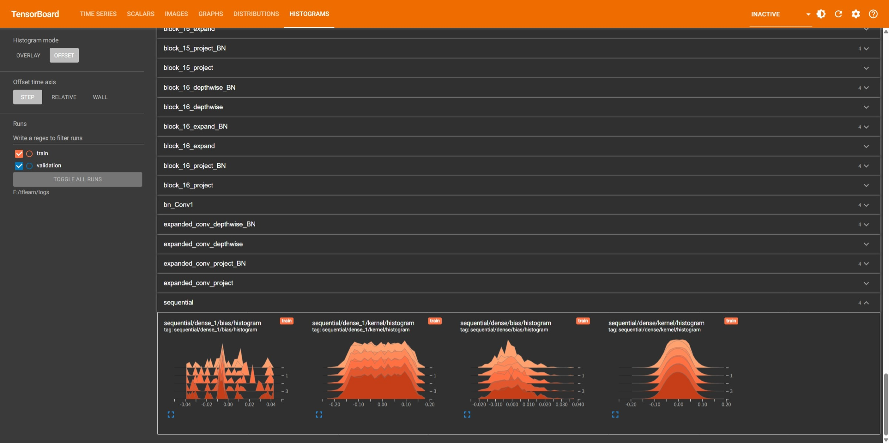

# Day 18: TensorBoard 调试实战

**日期：** 2026-06-10

## 核心认知转变

昨天（Day 17）训练太顺利了，TensorBoard 显得「也就那样」。今天故意制造 bug，用 TensorBoard 当诊断工具，3 秒定位问题。

> 就像体温计——量正常体温觉得跟手摸差不多，发烧的时候才知道它的价值。

## 三张图诊断法

| 图 | 诊断什么 | 发现什么 |
|---|---|---|
| loss 曲线 | 学没学 | 不降、震荡、卡住 |
| train vs val loss 对比 | 过没过度拟合 | 两条线分岔 |
| 权重直方图 | 每层活没活 | 某层不动、形状异常 |

## 实战：故意埋 bug 的模型

### 两个 bug

```python
# Bug 1: 隐藏层用 sigmoid（信息被压缩到 [0,1]）
tf.keras.layers.Dense(128, activation='sigmoid')

# Bug 2: Adam 学习率 0.1（默认 0.001 的 100 倍）
optimizer=tf.keras.optimizers.Adam(learning_rate=0.1)
```

### 诊断过程

**1. loss 曲线**

- 训练 loss 平稳下降
- 验证 loss **上蹿下跳**，和训练 loss 反复交叉
- → 经典过拟合信号

```
loss ↑
     │     ╭── 验证 loss 上蹿下跳
  0.8┤  ╭─╯
     │ ╱  ╲  ╱╲
  0.5┤╱    ╲╱  ╲╱╲
     │  ╱           ╲
  0.3┤─╱────────────── 训练 loss 稳稳下降
     └──────────────────→ epoch
```

**2. train vs val loss**

两线频繁交叉、差距拉大 → 模型记住了训练数据但不理解（验证时露馅）

**3. 权重直方图**

- 学习率过大 → 权重散得很开
- sigmoid 层（第三层）直方图只有两个峰，前两层 ReLU 有三个峰
- 原因：sigmoid 把值硬挤进 [0,1]，信息被压缩



### 三个 bug 叠加效应

| Bug | 后果 |
|---|---|
| 学习率 0.1 | 权重更新幅度过大，不稳定 |
| sigmoid 在隐藏层 | 值域太窄 [0,1]，信息丢失 |
| 两者叠加 | 既不稳又信息窄 → 严重过拟合 |

## 修复

```python
# 改 1: sigmoid → relu
tf.keras.layers.Dense(128, activation='relu')

# 改 2: 学习率恢复默认量级
optimizer=tf.keras.optimizers.Adam(learning_rate=0.001)
```

### 修复后对比

| | 有 bug | 修好后 |
|---|---|---|
| 训练 loss | 平稳下降 | 平稳下降 |
| 验证 loss | 上蹿下跳 | 稳步下降，和训练 loss 差距小 |
| sigmoid 层直方图 | 被压成两个峰 | 和其他 ReLU 层一样正常分布 |
| 诊断 | ⚠️ 过拟合 + 不稳定 | ✅ 正常学习 |

## 与 Day 17 的关系

- Day 17：学会用 TensorBoard（搭工具）
- Day 18：学会用 TensorBoard 调试（用工具）

这才是 TensorBoard 真正的价值——**不是装饰品，是调试工具**。

不再靠「猜」来调参，靠「看」来诊断。
